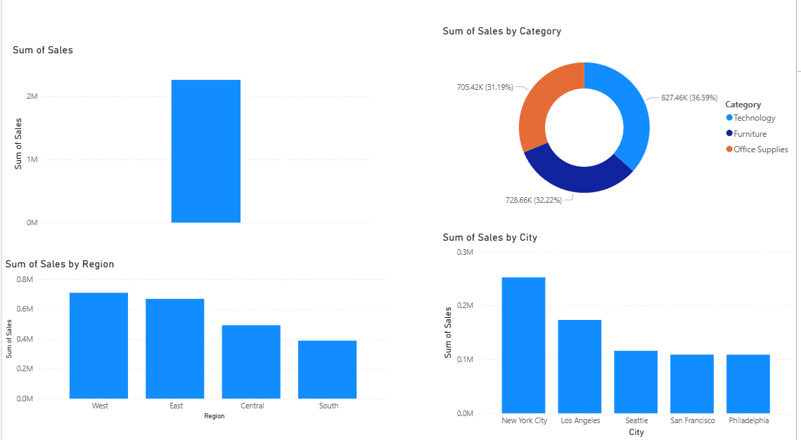

# Sales Analysis Dashboard (Power BI)

## Project Overview
This project analyzes sales data using SQL and Power BI to identify business insights such as top-performing regions, cities, and categories.

## Tools Used
- Power BI
- MySQL
- SQL
- CSV Dataset

## Dataset
The dataset contains sales transactions including:
- Order ID
- City
- Region
- Category
- Sales

## Key Insights
- Top 5 Cities by Sales
- Sales by Region
- Sales by Category
- Total Sales Overview

## Dashboard Preview

## SQL Queries
The following SQL queries were used for analysis:
- Total number of records
- Total sales
- Sales by region
- Top 5 cities by sales

## Files in this Repository
- Sales_Dashboard.pbix
- sales_data.csv
- sales_analysis_queries.sql
- sales_dashboard.png
